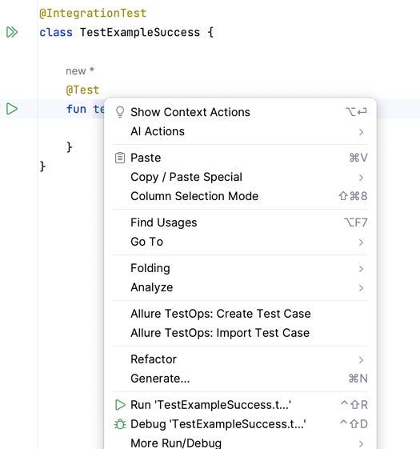
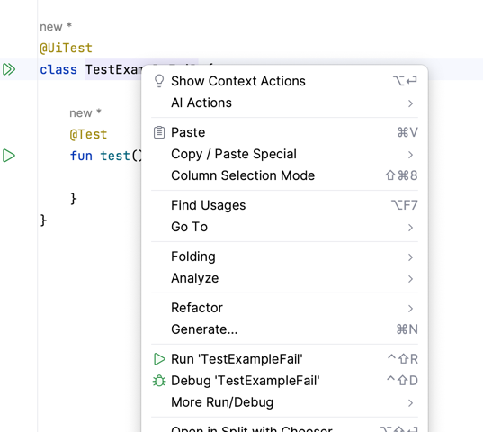
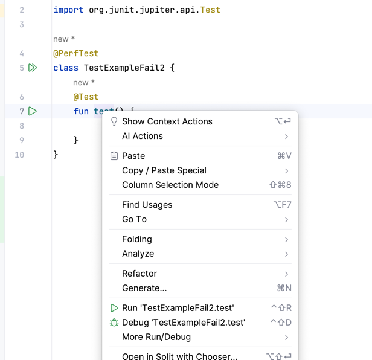

# Project reproducer

* test case
  * open test file
  * right-click on the test method
  * verify that `Allure TestOps: Create Test Case` present
  
## Actual results

* result for [TestExampleSuccess.kt](src%2Ftest%2Fkotlin%2FTestExampleSuccess.kt)

* result for [TestExampleFail.kt](src%2Ftest%2Fkotlin%2FTestExampleFail.kt)

* result for [TestExampleFail2.kt](src%2Ftest%2Fkotlin%2FTestExampleFail2.kt) 

